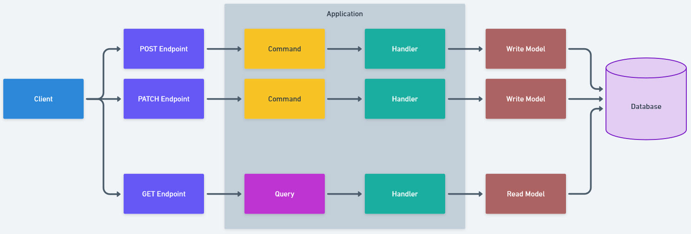

# CQRS Web API Example
CQRS, Command Query Responsibility Segregation is an architectural pattern designed to separate 
our reads from our write operations for a data store. Here we separate these concerns to maximize
our gains on performance, scalability and security needs while also assisting in the evolution of an
application.

###3 Principals
1. Commands should be task based, rather than data centric. 
   - Add Item to Cart, Remove Item from Cart, Update Item Quantity
2. Commands may be placed on a queue for asynchronous processing, rather than being processed synchronously.
3. Queries never modify the database. A query returns a DTO that does not encapsulate any domain knowledge.
  - Puts us in a better place to isolate our models
  - Helps ensure single responsibility

----

The diagram below represents the separations in each write and read channel respectively.

